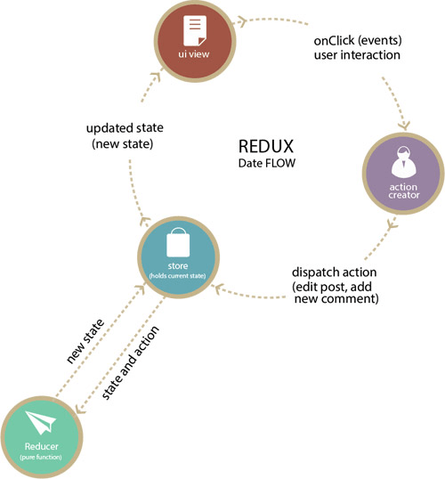

# Những vấn đề  quan trọng trong react
- Functional stateless component: Khai báo component dạng function (và không có state)
- componet (ưu tiên viết dạng class)
```
    // define with class
    class App extends Component {
        render() {

        }
    } 

    // define with function 
    function App() {

    }
```
- props: Tham số truyền vào cho component
- state: Component sẽ tự render lại khi có sự thay đổi của state 
- render list
``` 
    class List extends Component {
        render() {
            <>
                <li></li> 
                <li></li> 
                <li></li> 
            </>
        }
    }
```
- conditional rendering: Điều kiện render của một component sử dụng toán tử 3 ngôi
```
    class ListBall extends Component {
        // ...
        var lengthList = this.props.listBall 
        render() {
            {lengthList.length > 0 &&
                <h2>
                    You have {lengthList.length}.
                </h2>
            }
        }
    }
```
- handelling event: Xử lý sự kiện trong component
```
    class From extends Component {
        //...
        handelClick() {
            // handeling here
        }

        render() {
            <from>
                <input/>
                <button value="button" onClick={this.handelClick}/>
            </from>
        }
    }
```
- immutability: Không làm thay đổi thông số đầu vào
```
    function handellArray(props) {
        var tmp = ...props;
        console.log(tmp)
    }
```
- prop.child: Là những phần tử nằm bên trong của component đó
```
    class From extends Component {
        render() {
            <from>
                {this.props.child}
            </from>
        }
    }
    // use component From
    <From>
        <input/>
    </From>
    // this.props.child call inpt
```
- propTypes: Khai báo các props, khởi tạo kiểu dữ liệu cho props, dễ dàng hơn cho các tao tác truyền cho props của component, sử  dụng package "prop-types"
```
    //...
    import PropTypes from 'prop-types'

    class Person extends Component {

    }

    Person.proptypes = {
        name: PropTypes.string.isRequired 
        age: PropTypes.number
    }
```
- createRef: lấy DOM của một đối tượng
```
    //...
    var this.elementInput = React.createRef()

    render() {
        <input ref={this.elementInput}/>
    }

    //..

    - Lưu ý: Ref thường được dùng trong lifecycle của component (vì vấn đề về  render)
```
- LifeCycles: Vòng đời của một component
```
    //Mout
    componentWillMout () {} // Chạy trước render 
    render() {}
    componentDidMout() {} // Chạy sau khi chạy render
    // 
    componentWillReceiveProps(nextProps) {} //Chạy khi props thay đổi, Không render lại
    // Updete
    shouldComponentUpdate(nextProps, nextState) {} //Props và state thay đổi chạy trước render
    componentWillUpdate(nextProps, nextState) {} // Chạy sau shouldComponentUpdate, chạy trước render
    componentDidUpdate(nextProps, nextState) {} // Chạy sau render update
```
- React + Bootstrap: Như thư viện bootstrap bằng css  
- React + Story Book: Dùng để viết một react document cho dự án
- HOC (higher-order-component): Tái tạo và sử dụng lại component, nhận vào component và trả lại component
```
    https://codesandbox.io/s/01rjrkzv70
```
- Render props: Tùy biến render trong khi dùng component
```
    https://codesandbox.io/s/4wv0zx7ko4
```
- Context API: Truyền sữ liệu trong tree component (Tính năng này có nâng cấp trong cấu trúc của redux)
```
    https://codesandbox.io/s/73571z8900
```

### Tìm hiểu thêm
```
- Functional setState
- react hooks useState
- react hooks useContext
```

# Cấu trúc ứng dụng cho React js

## 1.Cấu trúc 1

### Cấu trúc 
```
- app 
    - data 
        - spec
        - artifacts
        - calls
        - filters
        - threads 
    - containers
    - components
    index.js
    rootReducer.js 
```
### Ưu điểm
    1. Cô lập phần miền dữ liệu và logic
    2. Các view sẽ được xây dựng dựa trên miền dữ liệu và sự phụ thuộc xác định
    3. Các component được tái sử dụng cho các view 

### Đóng gói miền dữ liệu 
    Tạo file index.js và đóng gói dữ liệu vào đó
    ```
    // data/calls/index.js
        import CallReducer from './CallReducer';
        import * as CallSelectors from './CallSelectors';
        import * as CallActions from './CallActions';
        export {
            CallReducer,
            CallSelectors,
            CallActions
        }
    // calls data 
    import { CallReducer, CallSelectors, CallActions } from '../data/calls'

    ```

### Lưu ý: Test nằm ở spec, krama

## Cấu trúc thứ 2

### Vấn đề import 

```
    - components
        - FilterSlider
            - tests
                FilterSlider-test.js
            FilterSlider.js
            FilterSlider.css
            package.json
```
#### File `package.json` sẽ đống vài trò làm rút ngắn path tới file FilterSlider.js

`package.json`
```
{
    "main": "FilterSlider.js"
}
```
```
import FilerSlider from 'root/FilterSlider'
```

### CSS trong React

- Styled components 
- EmotionJS
- Glamorous

### Các component phải có tính đơn nhiệm
### Sử dụng higher-order-component 

```
import React, { Component } from 'react';
import PropTypes from 'prop-types';
import { connect } from 'react-redux';
import { push } from 'react-router-redux';

export default function requiresAuth(WrappedComponent) {
    class AuthenticatedComponent extends Component {
        static propTypes = {
            user: PropTypes.object,
            dispatch: PropTypes.func.isRequired
        };

        componentDidMount() {
            this._checkAndRedirect();
        }

        componentDidUpdate() {
            this._checkAndRedirect();
        }

        _checkAndRedirect() {
            const { dispatch, user } = this.props;

            if (!user) {
            dispatch(push('/signin'));
            }
        }

        render() {
            return (
            <div className="authenticated">
                { this.props.user ? <WrappedComponent {...this.props} /> : null }
            </div>
            );
        }
        }

        const wrappedComponentName = WrappedComponent.displayName || WrappedComponent.name || 'Component';
        AuthenticatedComponent.displayName = `Authenticated(${wrappedComponentName})`;

        const mapStateToProps = (state) => {
        return {
            user: state.account.user
        };
    };

    return connect(mapStateToProps)(AuthenticatedComponent);
}
```

### Truyền hàm render vào component 

```
export default class Table extends Component {
  render() {
    return (
        <table>
            <thead>
                <tr>
                <th>Just a table</th>
                </tr>
            </thead>
            {this.props.children}
        </table>
    );
  }
}

```

```
import React, { Component } from "react";
 
export default class CollapsibleTableBody extends Component {
    constructor(props) {
        super(props);
        this.state = { collapsed: false };
    }

    toggleCollapse = () => {
        this.setState({ collapsed: !this.state.collapsed });
    };

    render() {
        return (
            <tbody>
                {this.props.children(this.state.collapsed, this.toggleCollapse)}
            </tbody>
        );
    }
}

//@ You’d use this component in the following way:
 
<Table>
    <CollapsibleTableBody>
        {(collapsed, toggleCollapse) => {
            if (collapsed) {
            return (
                <tr>
                    <td>
                        <button onClick={toggleCollapse}>Open</button>
                    </td>
                </tr>
            );
            } else {
            return (
                <tr>
                    <td>
                        <button onClick={toggleCollapse}>Closed</button>
                    </td>
                    <td>CollapsedContent</td>
                </tr>
            );
            }
        }}
    </CollapsibleTableBody>
</Table>
```

## 2. Cấu trúc Redux 
- Là cấu trúc quản lý state trong react, giúp đơn giản hóa sử trong việc sử dụng state (Những không nền quá lạm dụng)
- Các khái niệm trong redux
    - reducers
    - actions
    - state
    - store
    - constant




### Simple example
```
https://codesandbox.io/s/8zp6lwk7yj
```

### Middleware trong redux
```
- redux-thunk
- redux-saga
- redux-observable
```